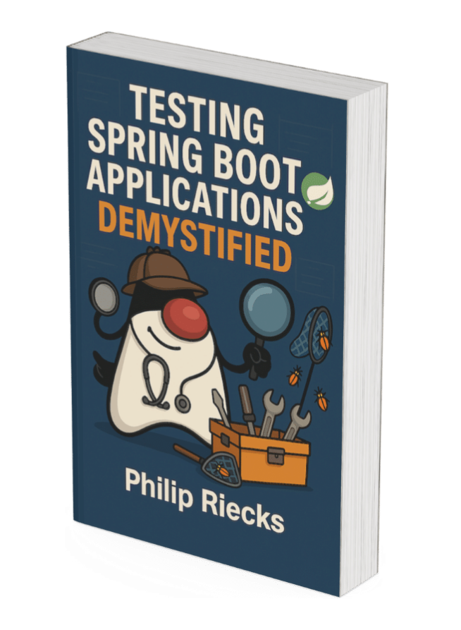

## About

Hi there 👋

With my [blogging](https://rieckpil.de) and [YouTube](https://www.youtube.com/c/rieckpil) efforts, I help developer to **make testing Spring Boot applications more joyful** or at least less painful. 

By providing clear and concise guides with thorough explanations and best practices, developers incorporate testing into their daily routine rather than making it an afterthought 🧪

Say hi on [X 🐥](https://x.com/rieckpil) or [LinkedIn 👔](https://www.linkedin.com/in/rieckpil/).

Joyful testing, 
Philip

## Testing Spring Boot Applications Made Simple 🍃

Spring Boot testing doesn't have to be a nightmare of broken configurations and unreliable tests.

**Stop guessing if your Spring Boot app will work in production** ❌

Poor tests mean late nights, stressed teammates, and disappointed stakeholders. Teams desperately need developers who can ship confidently.

**Become the developer your team relies on** ✅

Your teammates will trust your code, your deployments will succeed consistently, and you'll finally escape the cycle of emergency fixes that drain everyone's energy.

**Demystify testing real-world Spring Boot applications to deliver robust & maintainable code with confidence** 😵‍💫

Start your Spring Boot testing journey with the free eBook Testing Spring Boot Applications Demystified

  

» Get the practical guide trusted by **3,500+ developers** with 120+ Pages of hands-on advice for 🔗 [immediate download as PDF](https://rieckpil.de/free-spring-boot-testing-book/?utm_source=github-profile&utm_medium=free-download&utm_id=free-lead-magnet).

## Further Links 🔗

- [Spring Boot Testing Blog 🍃](https://rieckpil.de/testing-spring-boot-applications-masterclass/?utm_source=github&utm_medium=banner&utm_campaign=rieckpil-github-profile)
- [Build & Ship Software w/ Confidence - PragmaTech 🧪](https://pragmatech.digital/?utm_source=github&utm_medium=banner&utm_campaign=rieckpil-github-profile)
- [Stratospheric - From Zero To Production With Spring Boot And AWS (Online Course & eBook) 🚀](https://stratospheric.dev?utm_source=github&utm_medium=banner&utm_campaign=rieckpil-github-profile)
- [progmot - Random Thoughts about Programming & Motivation (Blog) 🏆](https://progmot.com?utm_source=github&utm_medium=banner&utm_campaign=rieckpil-github-profile)
